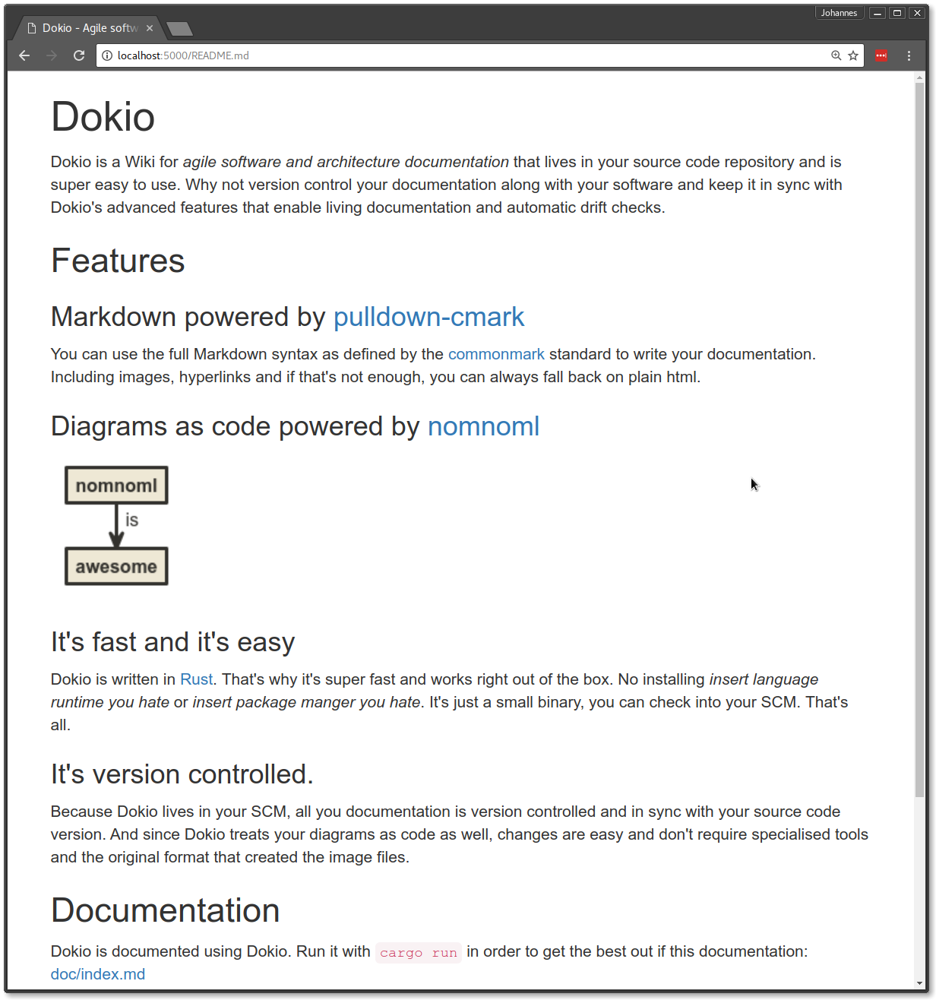

# Dokio 

Dokio is a Wiki for *agile software and architecture documentation* that lives in your source code repository and is super easy to use. Why not version control your documentation along with your software and keep it in sync with Dokio's advanced features that enable living documentation and automatic drift checks.

## Features

### It's Markdown powered by [pulldown-cmark](https://docs.rs/pulldown-cmark/0.0.11/pulldown_cmark/)

You can use the full Markdown syntax as defined by the [commonmark]() standard to write your documentation. Including 
images, hyperlinks and if that's not enough, you can always fall back on plain html.

### It's diagrams as code powered by [nomnoml](http://nomnoml.com/)

<pre class="diagram">
[nomnoml] is -> [awesome]
</pre>

### It's fast and it's easy to use.

Dokio is written in [Rust](https://www.rust-lang.org). That's why it's super fast and works right out of the box.
No installing *insert language runtime you hate* or *insert package manger you hate*. It's just a small binary, you can check into your SCM. That's all.

### It's version controlled.

Because Dokio lives in your SCM, all you documentation is version controlled and in sync with your source code version.
And since Dokio treats your diagrams as code as well, changes are easy and don't require specialised tools and the 
original format that created the image files. 

### It's beautiful.

Dokio uses Twitter Bootstrap for nice typography and beautiful CSS components.

### It's customisable.

Don't like the above theme? Write your own! It's easy.

### It's getting even better.

One of the next big features will be the ability to link your source code and documentation, so that they never go out 
of date again.

## Documentation

Dokio is documented using Dokio. Run it with `cargo run` in order to get the best out if this documentation:
[doc/index.md](doc/index.md)

## Configuration

Dokio is configured using a `Dokiofile` at the root of your Repository.

Here's an example `Dokiofile`:

    port = 4000; // default is 3000
    default_page = "usage.md"; // default is README.md
    theme = "my_company_theme"; // default is dokio
    
